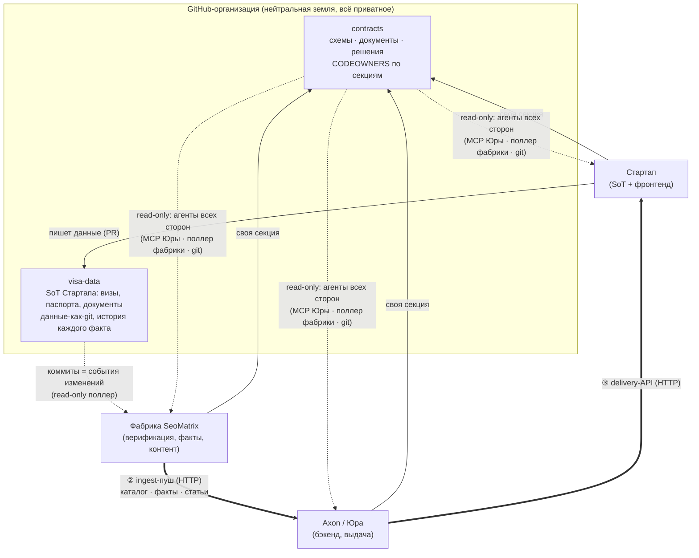
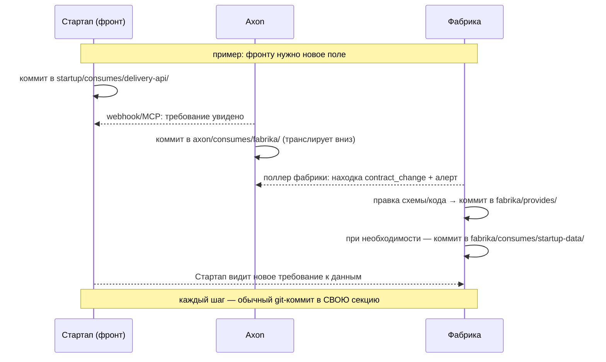

# Спецификация обмена контрактами и данными
### Стартап (SoT) · Фабрика (SeoMatrix) · Axon

> Статус: **draft для трёхстороннего согласования** · v0.1 · 2026-07-17
> Основа: обсуждение Юры (дека «Обмен контрактами между сервисами») + вводные всех сторон.

---

## 1. Принципы

1. **Через границы ходят только данные** — JSON/MD по git и HTTP. Код, стеки, промпты, инфраструктура сторон не раскрываются; каждый может заменить свой стек — остальные не заметят.
2. **Git — единственный источник правды для спецификаций и документов.** Пишем через коммит/PR в свою секцию; читаем все. Никакой пересылки файлов в чатах.
3. **Роли симметричны.** Каждый участник может и отдавать (provides), и запрашивать (consumes). Сегодняшний поток — текущее наполнение секций, а не зашитые роли; направление может меняться без перестройки схемы.
4. **Runtime отдельно от спецификаций.** Репо отвечает «в каком формате», API — «что и когда». Данные через контракт-репо не ходят.
5. **Расширяемость.** Новый участник/«морда» = новая секция + доступ в org. Ничего не перестраивается.

---

## 2. Топология



Сплошные стрелки — runtime-данные (HTTP). Пунктир — чтение спецификаций/событий. В org каждый пишет **только свою** секцию.

---

## 3. Репо №1 — `contracts`

```
contracts/
  startup/
    provides/data-feed/        # схема SoT-фида: оси, ISO-коды, provenance-поля
    consumes/delivery-api/     # что фронту Стартапа нужно от Axon
    docs/
  fabrika/
    provides/content-payloads/ # схемы наших payload'ов — ГЕНЕРЯТСЯ из кода валидатора
    consumes/startup-data/     # наши требования к данным SoT
    consumes/axon-ingest/      # наши требования/вопросы к платформе (axis, применимость, ramp)
    docs/
  axon/
    provides/ingest-api/       # ingest-контракт: хендлы, коды ошибок, ramp-политика
    provides/delivery-api/
    consumes/fabrika/          # требования Axon к фабрике (сюда переезжают брифинги)
    docs/
  vendored/
    visaforma/                 # read-only зеркала неподконтрольных вендоров (держит Фабрика)
  decisions/                   # трёхсторонние решения (ADR); мёрж = аппрув всех трёх сторон
```

**Правила:**
- **Владение секцией — механика, не конвенция**: CODEOWNERS (`/startup/ @startup-team`, `/fabrika/ @seomatrix`, `/axon/ @yura`) + branch protection с required review. Чужой PR в твою папку не смёржится без твоего аппрува.
- **`decisions/`** — CODEOWNERS на все три команды: общее решение физически требует трёх аппрувов.
- **Draft — явный статус**, не отсутствие файла: фронтматтер `status: draft` (или папка `drafts/`). Агенты на драфты не опираются.
- **provides Фабрики генерятся из кода** (экспорт из валидатора + CI-проверка «экспорт == закоммиченный контракт») — опубликованный контракт не может разойтись с реально применяемой валидацией. Практика рекомендуется всем сторонам.
- Документы (брифинги, заметки) — в `docs/` своей секции: те же диффы, ревью и история, что у контрактов.

---

## 4. Репо №2 — `visa-data` (SoT Стартапа)

Визовые данные — медленно меняющийся справочник (десятки правок в день), поэтому **данные-как-git**:

```
visa-data/
  destinations/<dest>/<passport>.json   # правила, документы, сборы для пары
  destinations/<dest>/_meta.json        # source_url, verified_at, кто проверил
```

Что это даёт бесплатно:
- **история каждого факта** (`git blame` = «кто и когда изменил правило») — критично для YMYL-домена;
- **коммиты = события изменений** — отдельный changes-фид не нужен: потребители читают commits API с watermark;
- **правки данных через PR** — Стартап ревьюит собственные данные как код;
- ноль инфраструктуры на старте.

**Provenance — ключевая договорённость.** Если записи несут официальный `source_url` + `verified_at` → данные проходят факт-гейт Фабрики напрямую (быстрый конвейер). Если нет → фид работает как триаж (говорит «что проверить»), а официальные источники цитирует Фабрика.

**Порог переезда на API:** высокий QPS прямого чтения SoT (по текущей схеме фронт читает у Axon, так что порог далёк). Если у Стартапа уже есть БД+API — данные по API, в `visa-data` остаётся только схема.

---

## 5. Runtime-каналы (вне GitHub, как есть)

| Канал | Кто → кому | Что |
|---|---|---|
| ① SoT-фид | Стартап → Фабрика | данные пар паспорт×направление (git-коммиты или их API) |
| ② ingest | Фабрика → Axon | каталог, факты, статьи (уже live) |
| ③ delivery | Axon → фронт Стартапа | выдача контента/данных |
| todo-фид | Axon → Фабрика | runtime-спрос: demand, stale, coverage (уже live) |
| будущие | любой → любой | новый канал = новый `provides/` в своей секции + свой API |

---

## 6. Механика каскада требований



Каскад работает в любую сторону — «запросить» = закоммитить consumes; уведомления событийные (webhook у Юры, поллер-в-конвейер у Фабрики).

---

## 7. Модель доступа

- Org и оба репо — **приватные**; люди — в teams своей компании, у каждого write только в свою секцию (CODEOWNERS), read — на всё.
- Машины (поллер Фабрики, MCP-сервер Axon, CI) — **fine-grained PAT read-only**.
- Приватные репозитории сторон (монорепо Axon, SeoMatrix, код Стартапа) наружу не выходят вообще.

---

## 8. Дорожная карта

| Уровень | Что | Кто |
|---|---|---|
| 0 | Org + оба репо + структура секций + перенос существующих доков | хостинг — договориться; черновик структуры готовит Фабрика |
| 1 | События: webhook→чат (Axon) · поллер→конвейер задач (Фабрика) | каждый у себя |
| 2 | MCP-сервер над contracts (Go) | Axon |
| 2а | Экспортёр provides из валидатора + CI-гард | Фабрика |
| 3 | Валидация дрифта схем в CI (когда drafts стабилизируются) | позже, все |

---

## 9. Открытые вопросы к трёхсторонней встрече

1. **Provenance в SoT** (официальный source_url + verified_at?) — определяет быстрый/триажный сценарий и ответственность за верность данных (YMYL).
2. Кто хостит org (технически безразлично — CODEOWNERS защищает всех).
3. SLA свежести SoT-фида.
4. Ramp-политика Axon при масштабировании потока контента.
5. Дата переключения: брифинги/спеки только через репо, файлы в чатах — deprecated.
